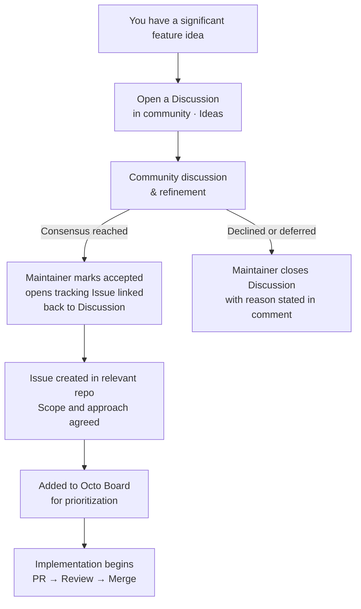

# Octo Governance

This document describes how significant decisions are made in the Octo open-source project — who has authority, how features are proposed, and how community input shapes the roadmap.

---

## Maintainers

Current maintainers with merge rights and Octo Board authority:

| Name | GitHub | Role |
|------|--------|------|
| 李梦林 | [@lml2468](https://github.com/lml2468) | Project Lead |

> **Current status:** Octo currently operates with a single Project Lead. Additional maintainers will be added as the project grows. Until then, the Project Lead has final authority on all decisions.

Maintainers are responsible for:
- Reviewing and merging pull requests
- Closing or converting community Discussions into tracked Issues
- Setting priorities on the [Octo Board](https://github.com/orgs/Mininglamp-OSS/projects)
- Releasing new versions

### Becoming a Maintainer

Octo's maintainer bar is contribution quality and judgment, not seniority.

**Eligibility:** A contributor may be considered if they have:
- Sustained, high-quality contributions over at least 3 months (code, reviews, Discussions, or docs)
- Demonstrated good judgment in issue triage, code review, or community Discussions

**Nomination:** Any existing maintainer (or the Project Lead) may nominate a contributor. Self-nomination is also welcome — open a Discussion in the [General](https://github.com/Mininglamp-OSS/community/discussions/categories/general) category.

**Approval:** The Project Lead approves all maintainer additions at the current stage of the project.

**Off-boarding:** A maintainer may step down at any time by notifying the Project Lead. A maintainer inactive for 6+ months may be moved to Emeritus status after a notice period.

---

## Feature Development Process

Octo follows a **Discussion-first** approach for significant features, inspired by mature open-source governance models such as the [Rust RFC process](https://github.com/rust-lang/rfcs), [Vue RFCs](https://github.com/vuejs/rfcs), and [Kubernetes KEPs](https://github.com/kubernetes/enhancements). The goal is simple: **align on what to build and why before writing a single line of code.**

### Flow

### What Requires a Discussion?

A feature **must** go through a community Discussion before being added to the Octo Board if it meets any of the following criteria:

- Introduces a **new user-facing concept** or a new API surface
- **Changes existing behavior** in a potentially breaking or surprising way
- Requires **coordination across more than one repository** (e.g., both `octo-server` and `octo-web`)
- Has significant **UX or architectural implications**
- Would **alter a public API** or existing data model

Minor improvements, bug fixes, small ergonomic wins, and documentation updates may be filed directly as Issues without a prior Discussion. See [CONTRIBUTING.md](https://github.com/Mininglamp-OSS/.github/blob/main/CONTRIBUTING.md) for the day-to-day contribution flow.

If you are unsure, open a Discussion — the Project Lead will guide you.

### How to Write a Feature Discussion

Open a new Discussion in the **[Ideas](https://github.com/Mininglamp-OSS/community/discussions/categories/ideas)** category. A structured template is pre-filled automatically when you start a new Discussion there. It covers:

- **Problem** — what you're solving and who is affected
- **Proposed Solution** — what Octo should do differently (rough sketches welcome)
- **Alternatives Considered** — other approaches and why you prefer your proposal
- **Additional Context** — screenshots, references, related issues

Please use `[Feature] Short description` as your Discussion title.

### Reaching Consensus

A Discussion is ready to be converted into a tracked Issue when:

1. The **problem** is clearly understood and agreed upon by participants.
2. The **proposed solution** (or a refined version of it) has no unresolved blocking objections.
3. **The Project Lead explicitly marks the outcome** in a closing comment.

When a Discussion is closed, the outcome is always declared in the closing comment:

| Outcome | What happens |
|---------|--------------|
| **Accepted** | Project Lead closes the Discussion and opens a tracking Issue linked back to it |
| **Declined** | Project Lead closes with a brief explanation (e.g., out of scope, conflicts with roadmap) |
| **Deferred** | Project Lead closes with a note to revisit (e.g., "revisit at v2.0") |

> Consensus does not mean unanimous agreement — it means no unresolved blocking concerns remain.
>
> **The Project Lead has final authority** when the community cannot converge on its own.

---

## Decision-Making

For day-to-day decisions (bug triage, dependency updates, minor improvements), the Project Lead acts autonomously.

For significant decisions — new features, breaking changes, deprecations, major architectural shifts — the Discussion-first process above applies. Decisions made through that process are final once the Project Lead closes the Discussion and creates the tracking Issue.

As the maintainer team grows beyond one, this document will be updated with a tie-breaking rule. Until then, **the Project Lead has final authority** on all decisions.

---

## Security

For security vulnerabilities, do **not** open a public Discussion or Issue. Follow the private disclosure process described in [SECURITY.md](https://github.com/Mininglamp-OSS/.github/blob/main/SECURITY.md).

---

## Code of Conduct

All participants in Octo community spaces are expected to follow our [Code of Conduct](https://github.com/Mininglamp-OSS/.github/blob/main/CODE_OF_CONDUCT.md). The Project Lead is responsible for enforcement.

---

## Amendments

This document may be amended via a pull request to this repository. Any amendment that materially changes governance rules must be announced in the [Announcements](https://github.com/Mininglamp-OSS/community/discussions/categories/announcements) discussion category before merging. Non-maintainer contributors are welcome to propose amendments via PR; approval by the Project Lead is required.
