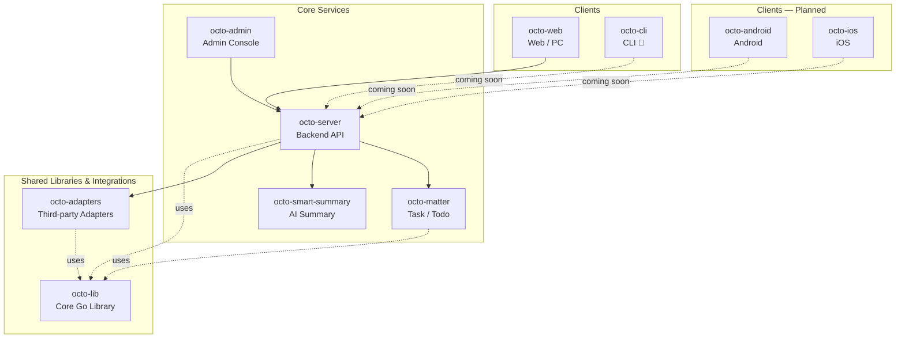

<!-- TODO: Replace with Octo logo once available -->
<!-- <p align="center"></p> -->

<h1 align="center">Octo</h1>

<p align="center">
  <strong>Open-source, AI-native team collaboration — where AI Agents and humans work as one.</strong>
</p>

<p align="center">
  <a href="https://github.com/Mininglamp-OSS"></a>&nbsp;
  <a href="LICENSE"></a>&nbsp;
  <a href="https://discord.gg/vj9Vsj9hSB"></a>&nbsp;
  <a href="README.zh.md"></a>
</p>

<p align="center">
  <a href="https://github.com/Mininglamp-OSS/community/discussions">Discussions</a> &middot;
  <a href="https://discord.gg/vj9Vsj9hSB">Discord</a> &middot;
  <a href="https://github.com/Mininglamp-OSS">All Repos</a> &middot;
  <a href="GOVERNANCE.md">Governance</a>
</p>

---

## What is Octo?

Octo is an open-source, AI-native team collaboration platform. It puts AI Agents — called **Lobsters** — and human teammates on the same collaboration layer, so AI handles the thinking & doing while humans focus on what only they can bring: **taste**.

The name **OCTO** captures the four pillars of the platform:

| Letter | Pillar | Meaning |
|--------|--------|---------|
| **O** | Open | Open-source, self-hosted, full data sovereignty |
| **C** | Context | Three-layer context protection: public knowledge, internal knowledge, personal tacit experience |
| **T** | Taste | Human judgment and taste — the irreplaceable part |
| **O** | Orchestration | Humans + Agents + tools coordinated in a single collaboration layer |

## Key Features

- **AI Agents as Teammates** — Lobsters join channels, pick up tasks, and collaborate just like human members.
- **Three-Layer Context** — Public knowledge, internal docs, and personal tacit experience are kept separate and secure.
- **Human Taste in the Loop** — AI proposes, humans decide. Judgment stays where it belongs.
- **Self-Hosted & Data Sovereign** — Deploy on your own infrastructure. Your data never leaves your control.
- **Real-Time Messaging** — Built on WuKongIM for reliable, low-latency communication at scale.
- **Modular Microservices** — Each service is an independent repo — adopt what you need, extend what you want.

## Ecosystem



| Repository | Language | Purpose |
|------------|----------|---------|
| [octo-server](https://github.com/Mininglamp-OSS/octo-server) | Go | Backend API + Lobster agent scheduling |
| [octo-web](https://github.com/Mininglamp-OSS/octo-web) | TypeScript / React | Web + PC (Electron) client |
| octo-android | Kotlin / Java | Native Android client — 🚧 Coming Soon |
| octo-ios | Swift | Native iOS client — 🚧 Coming Soon |
| [octo-cli](https://github.com/Mininglamp-OSS/octo-cli) | Go | Command-line interface — 🚧 Coming Soon |
| [octo-admin](https://github.com/Mininglamp-OSS/octo-admin) | TypeScript / React | Operations console |
| [octo-matter](https://github.com/Mininglamp-OSS/octo-matter) | Go | Task / todo microservice |
| [octo-smart-summary](https://github.com/Mininglamp-OSS/octo-smart-summary) | Go | LLM-powered conversation summary |
| [octo-lib](https://github.com/Mininglamp-OSS/octo-lib) | Go | Shared Go library |
| [octo-adapters](https://github.com/Mininglamp-OSS/octo-adapters) | TypeScript / Python | Third-party adapters |
| [octo-deployment](https://github.com/Mininglamp-OSS/octo-deployment) | Shell / YAML | K8s & Docker production deployment |

## Quickstart

Get Octo running locally in three steps with Docker Compose:

```bash
# 1. Clone the deployment repo
git clone https://github.com/Mininglamp-OSS/octo-deployment.git
cd octo-deployment

# 2. Configure environment
cp docker/.env.example docker/.env
# Edit docker/.env — at minimum, generate secure values for:
#   MYSQL_ROOT_PASSWORD, MINIO_ROOT_PASSWORD, OCTO_MINIO_APP_PASSWORD,
#   OCTO_MASTER_KEY, OCTO_NOTIFY_INTERNAL_TOKEN, OCTO_WUKONGIM_MANAGER_TOKEN,
#   OCTO_MATTER_DB_PASSWORD, OCTO_SUMMARY_DB_PASSWORD, OCTO_SUMMARY_READER_PASSWORD
# Tip: use `openssl rand -hex 32` to generate each secret.

# 3. Start all services
cd docker && docker compose up -d
```

Once running, visit **http://octo.local:28080** (add `127.0.0.1 octo.local` to `/etc/hosts` first).

## Architecture Notes

Octo's real-time messaging layer is powered by [WuKongIM](https://github.com/WuKongIM/WuKongIM), a high-performance IM engine. It handles message routing, delivery guarantees, and channel management, allowing Octo to focus on collaboration logic rather than low-level messaging infrastructure.

## Community

| Channel | Best for |
|---------|----------|
| [GitHub Discussions](https://github.com/Mininglamp-OSS/community/discussions) | Questions, ideas, feature proposals, async discussions |
| [Discord](https://discord.gg/vj9Vsj9hSB) | Real-time chat for international contributors |
| Octo Dev Community (via Octo App) | Real-time collaboration for Chinese-speaking contributors |

## Contributing

We welcome contributions of all kinds — code, docs, bug reports, and ideas. Please read [CONTRIBUTING.md](https://github.com/Mininglamp-OSS/.github/blob/main/CONTRIBUTING.md) and [GOVERNANCE.md](GOVERNANCE.md) before getting started.

## Star History

> Tracking the 6 core product repos (octo-lib and octo-admin are infrastructure/tooling and excluded from the trend chart).

[](https://star-history.com/#Mininglamp-OSS/octo-web&Mininglamp-OSS/octo-server&Mininglamp-OSS/octo-adapters&Mininglamp-OSS/octo-deployment&Mininglamp-OSS/octo-matter&Mininglamp-OSS/octo-smart-summary&Date)

## License

Octo is licensed under the [Apache License 2.0](LICENSE).
