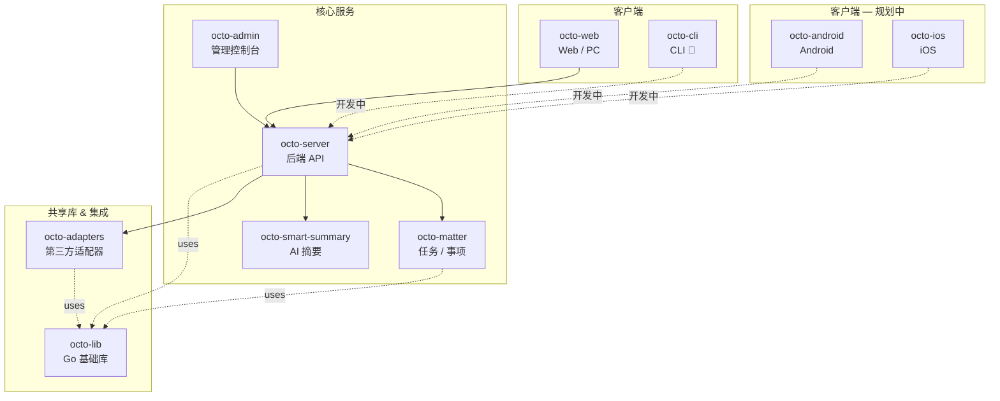

<!-- TODO: 待 Logo 定稿后替换 -->
<!-- <p align="center"></p> -->

<h1 align="center">Octo</h1>

<p align="center">
  <strong>开源 AI 原生团队协作平台 —— 让 AI Agent 与人类在同一层共事。</strong>
</p>

<p align="center">
  <a href="https://github.com/Mininglamp-OSS"></a>&nbsp;
  <a href="LICENSE"></a>&nbsp;
  <a href="https://discord.gg/vj9Vsj9hSB"></a>&nbsp;
  <a href="README.md"></a>
</p>

<p align="center">
  <a href="https://github.com/Mininglamp-OSS/community/discussions">讨论区</a> &middot;
  <a href="https://discord.gg/vj9Vsj9hSB">Discord</a> &middot;
  <a href="https://github.com/Mininglamp-OSS">所有仓库</a> &middot;
  <a href="GOVERNANCE.md">治理流程</a>
</p>

---

## Octo 是什么？

Octo 是一个开源 AI 原生团队协作平台。它让 AI Agent（我们称之为 **Lobster**）和人类队友工作在同一个协作层——AI 负责 thinking & doing，人类负责只有自己能做的事：**tasting**（判断与品味）。

**OCTO** 这个名字本身就是设计理念的缩写：

| 字母 | 支柱 | 含义 |
|------|------|------|
| **O** | Open | 开源、可自托管、数据完全自主 |
| **C** | Context | 三层上下文保护：公共知识 / 内部知识 / 个人隐性经验 |
| **T** | Taste | 人类的判断力与品味——不可被复制的部分 |
| **O** | Orchestration | 人 + Agent + 工具在同一协作层被统一协调 |

## 核心特性

- **AI Agent 即队友** —— Lobster 加入频道、领取任务、协作沟通，和真人成员无异。
- **三层上下文保护** —— 公共知识、内部文档、个人隐性经验分层隔离，安全可控。
- **人类品味在环** —— AI 提议，人类决策。判断力始终在该在的位置。
- **自托管 & 数据自主** —— 部署在你自己的基础设施上，数据不出你的边界。
- **实时通信** —— 基于 WuKongIM 构建，提供可靠、低延迟的大规模即时通信能力。
- **模块化微服务** —— 每个服务独立仓库，按需采用，随意扩展。

## 生态全景



| 仓库 | 语言 | 定位 |
|------|------|------|
| [octo-server](https://github.com/Mininglamp-OSS/octo-server) | Go | 后端 API + Lobster Agent 调度 |
| [octo-web](https://github.com/Mininglamp-OSS/octo-web) | TypeScript / React | Web + PC（Electron）客户端 |
| octo-android | Kotlin / Java | 原生 Android 客户端 — 🚧 Coming Soon |
| octo-ios | Swift | 原生 iOS 客户端 — 🚧 Coming Soon |
| octo-cli | Go | 命令行工具 — 🚧 Coming Soon |
| [octo-admin](https://github.com/Mininglamp-OSS/octo-admin) | TypeScript / React | 运维管理控制台 |
| [octo-matter](https://github.com/Mininglamp-OSS/octo-matter) | Go | 任务 / 事项微服务 |
| [octo-smart-summary](https://github.com/Mininglamp-OSS/octo-smart-summary) | Go | 基于 LLM 的会话摘要服务 |
| [octo-lib](https://github.com/Mininglamp-OSS/octo-lib) | Go | Go 公共基础库 |
| [octo-adapters](https://github.com/Mininglamp-OSS/octo-adapters) | TypeScript / Python | 第三方服务适配器 |
| [octo-deployment](https://github.com/Mininglamp-OSS/octo-deployment) | Shell / YAML | K8s & Docker 生产级部署 |

## 快速开始

通过 Docker Compose 三步启动 Octo：

```bash
# 1. 克隆部署仓库
git clone https://github.com/Mininglamp-OSS/octo-deployment.git
cd octo-deployment

# 2. 配置环境变量
cp docker/.env.example docker/.env
# 编辑 docker/.env，至少为以下密钥生成安全值：
#   MYSQL_ROOT_PASSWORD, MINIO_ROOT_PASSWORD, OCTO_MINIO_APP_PASSWORD,
#   OCTO_MASTER_KEY, OCTO_NOTIFY_INTERNAL_TOKEN, OCTO_WUKONGIM_MANAGER_TOKEN,
#   OCTO_MATTER_DB_PASSWORD, OCTO_SUMMARY_DB_PASSWORD, OCTO_SUMMARY_READER_PASSWORD
# 提示：使用 openssl rand -hex 32 生成每个密钥。

# 3. 启动所有服务
cd docker && docker compose up -d
```

启动完成后访问 **http://octo.local:28080**（需先在 `/etc/hosts` 中添加 `127.0.0.1 octo.local`）。

## 架构说明

Octo 的实时通信层由 [WuKongIM](https://github.com/WuKongIM/WuKongIM) 驱动——一个高性能 IM 引擎。它负责消息路由、投递保障和频道管理，使 Octo 可以专注于协作业务逻辑，而无需处理底层通信基础设施。

## 社区

| 渠道 | 适合场景 |
|------|----------|
| [GitHub Discussions](https://github.com/Mininglamp-OSS/community/discussions) | 问题求助、功能提案、创意讨论、异步交流 |
| [Discord](https://discord.gg/vj9Vsj9hSB) | 国际开发者实时交流 |
| Octo 开发者社区（通过 Octo App 加入） | 国内开发者实时协作 |

## 参与贡献

我们欢迎各种形式的贡献——代码、文档、Bug 反馈、建议。开始之前请阅读 [CONTRIBUTING.md](https://github.com/Mininglamp-OSS/.github/blob/main/CONTRIBUTING.md) 和 [GOVERNANCE.md](GOVERNANCE.md)。

## Star 趋势

> 追踪 6 个核心产品仓库（octo-lib、octo-admin 和私有仓库 octo-cli 不纳入趋势图）。

[](https://star-history.com/#Mininglamp-OSS/octo-web&Mininglamp-OSS/octo-server&Mininglamp-OSS/octo-adapters&Mininglamp-OSS/octo-deployment&Mininglamp-OSS/octo-matter&Mininglamp-OSS/octo-smart-summary&Date)

## 许可证

Octo 基于 [Apache License 2.0](LICENSE) 开源。
